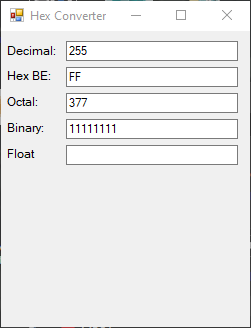

# Hex-Converter
Simple base convert base on 010 Editor's base converter

Supports inputs for Decimal, Hex BE, Octal, and Binary. Output for Floats

To Do:
- Add Float input
- Added Little Endian support.

