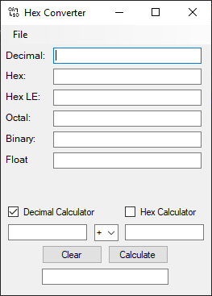
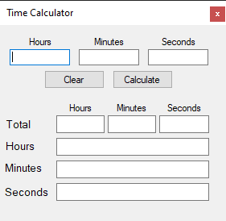

# Hex-Converter
Simple base convert base on 010 Editor's base converter

Supports inputs for Decimal, Hex BE, Octal, and Binary. Output for Floats

v0.4
- Added Decimal Calculator option
- Added New Time Calculator

v0.3
- Added Hex Calculator
- Added Icon
- Fixed exception handling 

v0.2
- Added Float input
- Added Little Endian export

To Do:
- Add Little Endian Input.

